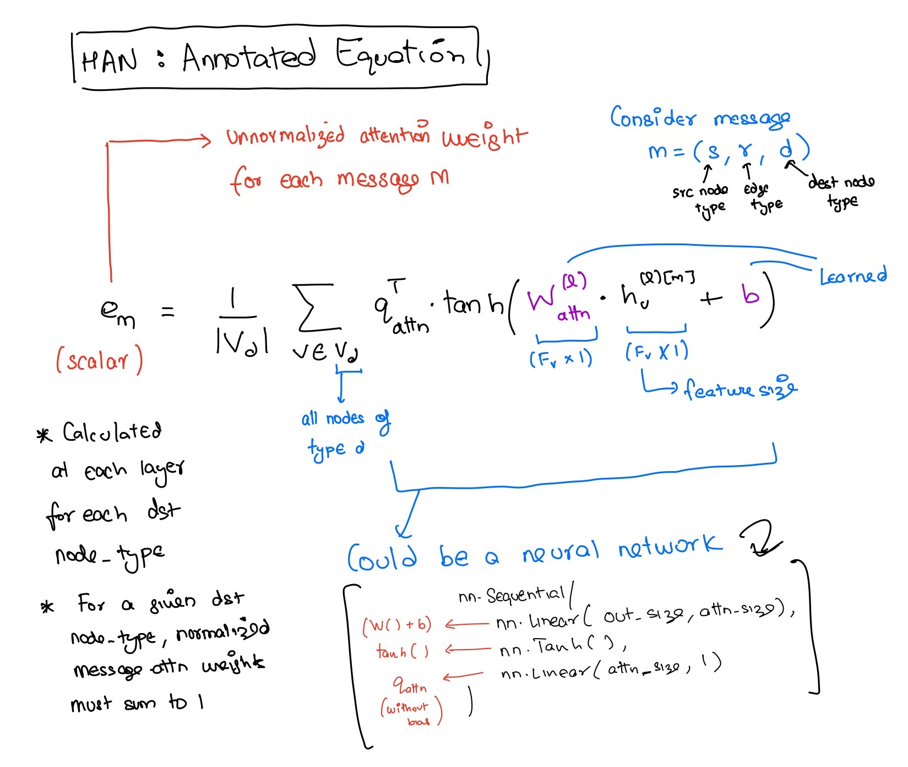

# CS224W Solutions (Fall 2021)
Solutions to CS224W Colab and Homework.

Source: https://web.stanford.edu/class/cs224w/

- [x] Colab 0: Intro to Graph Tools
- [x] Colab 1: Intro to node embeddings, torch_geometric
- [x] Colab 2: Building GNN using torch_gemetric
- [x] Colab 3: GraphSage
- [x] Colab 4: GAT
- [x] Colab 5: Heterogenous Graph Training

##### Annotated Heterogenous Graph Attention Network Equation
Annotated  (semantic level attention) equation used in Colab 5 for heterogenous graph message passing.

